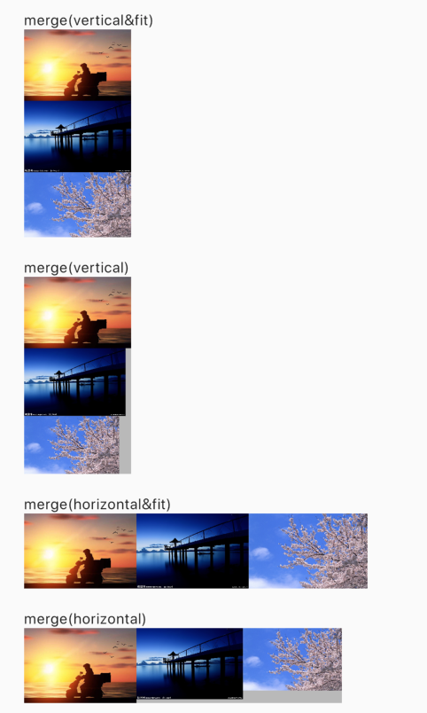

# merge_images in flutter

<a href="https://https://pub.dev/packages/merge_images"></a>  </a><a href="https://opensource.org/licenses/MIT"></a>

## 简介 
合并图片（垂直或水平方向）



## 特性
* 支持水平和垂直方向
* 提供helper可在代码中合并多张图片并得到合并后的图片，也提供widget直接合并并显示图片。
* 可自动缩放图片以保持一致（垂直时对齐宽度，水平时对齐高度）

## 用法
#### ImagesMergeHelper
使用这个helper在代码中合并图片

``` dart
ui.Image image = await ImagesMergeHelper.margeImages(
[assetImage1,assetImage2,providerImage],///必传，图片list
   fit: true,///是否缩放图片以保持一致
   direction: Axis.vertical,///合并的方向
   backgroundColor: Colors.black26);///背景颜色
```
此外，它也提供了几个方法做图片类型的转换:
``` dart
///ui.Image to Uint8List
Uint8List bytes = await ImagesMergeHelper.imageToUint8List(image);
///ui.Image to File
File file = await ImagesMergeHelper.imageToFile(image);
///Uint8List to ui.Image
ui.Image image = await ImagesMergeHelper.uint8ListToImage(imageBytes);
///file to ui.Image
ui.Image image = await ImagesMergeHelper.loadImageFromFile(file);
///asset to ui.Image
ui.Image image = await ImagesMergeHelper.loadImageFromAsset(assetPath);
///ImageProvider to ui.Image
ui.Image image = await ImagesMergeHelper.loadImageFromProvider(imageProvider);

```
#### ImageMerge
使用这个widget直接显示图片
``` dart
ImagesMerge(
  imageList,///必传，图片list
  direction: Axis.vertical,///合并方向
  backgroundColor: Colors.black26,///背景颜色
  fit: false,///是否缩放图片以保持一致
  controller: captureController,///用以获取截图的controller
),
```
另外，这个widget已经包裹了一层RepaintBoundary，所以你可以通过传入一个CaptureController的实例，并调用capture()方法获取截图。
``` dart
///获取截图
 getCapture() async{
  Uint8List bytes = await captureController.capture();
  }
```
##LICENSE
MIT License